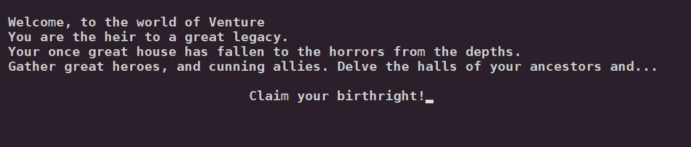
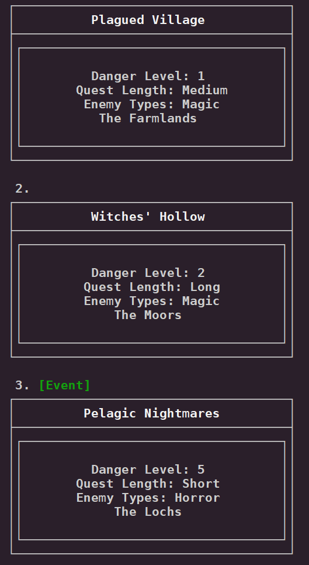
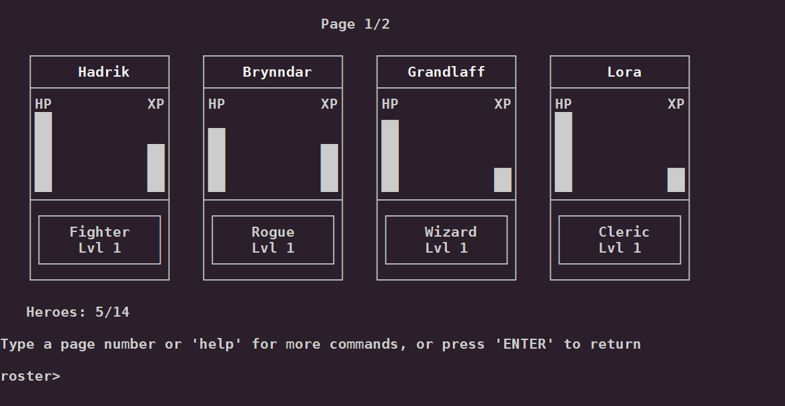
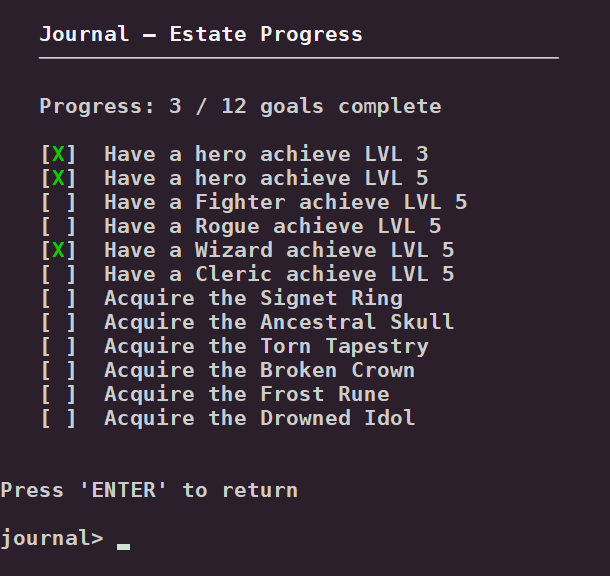

A terminal-based RPG management game. Recruit heroes, send them on quests, manage your roster, and reclaim your ancestral estate.

**Alpha Build `v0.1.4`** — early access build. Expect rough edges and missing content.

---

## Overview



### Game Lore

You inherit a fallen estate and must rebuild it by recruiting heroes, sending them on quests locations, and surviving the events that reshape your campaign each week.

### Requirements
- Python 3.10 or later

---

## Features

### Quests & Locations
- Three quest slots per week with scaling danger (1–5) and length (Short / Medium / Long)
- Five regions: **The Estate**, **The Farmlands**, **The Moors**, **The Mountains**, **The Lochs**
- Each region has a unique enemy pool and a boss quest



### Events
- A new event occurs each week, shaping the conditions of your campaign
- Events range from boons and opportunities to threats and complications
- Rare events can have significant and lasting consequences

### Classes
- Four classes: **Fighter**, **Rogue**, **Wizard**, **Cleric** — each with unique resistances, weaknesses, and class bonuses
- Heroes gain EXP and level up to 5, unlocking stronger bonuses and spells
- Fighter: reduces quest duration · Rogue: earns bonus gold · Cleric: heals party after quests



### Journal & Graveyard
- Journal tracks estate goals: hero milestones, relics acquired, bosses defeated
- Graveyard records every fallen hero with date, quest, and enemy details



### Display
- Responsive layout with compact and full modes based on terminal size
- Live resize support — the screen redraws mid-prompt when the terminal is resized
- ASCII art title screen with large and small variants
- Block-character progress bars and card-based UI for heroes, quests, and spells


---

## Commands

| Command     | Description                                      |
|-------------|--------------------------------------------------|
| `quest`     | View and embark on available quests              |
| `roster`    | View and manage your heroes                      |
| `recruit`   | Hire new heroes (unlocked after first quest)     |
| `spells`    | Cast wizard spells (requires Wizard lvl 2+)      |
| `graveyard` | View fallen heroes                               |
| `journal`   | View estate goals and progress                   |
| `help`      | List available commands                          |
| `quit`      | Exit the game                                    |

---

## Installation

### Linux

```bash
git clone https://github.com/OrkoTheMage/venture.git
cd venture
pip install --user -e .
```

This installs the `venture` command to `~/.local/bin/`. If it isn't on your PATH, add this to your shell config:

```bash
export PATH="$HOME/.local/bin:$PATH"
```

### MacOS

The user scripts directory is typically `~/Library/Python/3.x/bin/`. Add it to `~/.zshrc`:

```bash
export PATH="$HOME/Library/Python/$(python3 -c 'import sys; print(f"{sys.version_info.major}.{sys.version_info.minor}")')/bin:$PATH"
```

Or use **pipx** for an isolated install with no PATH editing:

```bash
pipx install -e /path/to/venture
```

### Run

```bash
venture
```

### Run from source

```bash
cd venture
PYTHONPATH=src python -m venture
```

> Save state is stored in `~/.venture_state.json`. Delete it to start a fresh campaign.

---

## Credit
Aeryn G (OrkoTheMage)
