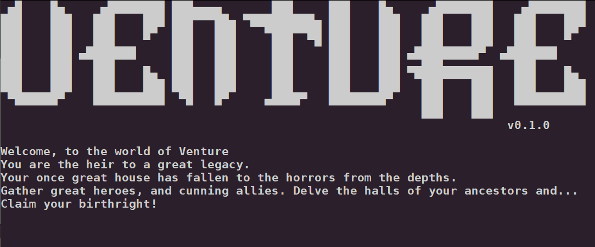

# Venture
A terminal-based RPG management game. Recruit heroes, send them on quests, manage your roster, and reclaim your ancestral estate.

> **Alpha Build** — early access build. Expect rough edges and missing content.

---

## Section 1 — Overview



A terminal-based RPG management game. Recruit heroes, send them on quests, manage your roster, and reclaim your ancestral estate.

### Requirements
- Python 3.10 or later
- A terminal at least 80 columns wide (115+ recommended for the large ASCII art)

### Features
- Terminal-first RPG: manage a roster of heroes and send them on procedurally structured quests from the command line.
- Recruit and build a party: hire fighters, wizards, rogues, and more — each with class-specific bonuses and progression.
- Quest system: embark on quests with variable difficulty, rewards, and outcomes tracked across your campaign.
- Spell casting: wizards unlock a spell system at level 2+ with a dedicated spell card view.
- Persistent save state stored in `~/.venture_state.json` — resume your campaign at any time.
- Graveyard and journal: track fallen heroes and review completed quest history.
- Styled ASCII art rendering with large and small display modes.
- Debug mode (`--debug`) for development and troubleshooting.

### Commands

| Command     | Description                                      |
|-------------|--------------------------------------------------|
| `quest`     | View and embark on available quests              |
| `roster`    | View and manage your heroes                      |
| `recruit`   | Hire new heroes (unlocked after first quest)     |
| `spells`    | Cast wizard spells (requires Wizard lvl 2+)      |
| `graveyard` | View fallen heroes                               |
| `journal`   | Review completed quest history                   |
| `help`      | List available commands                          |
| `quit`      | Exit the game                                    |

---

## Section 2 — Installation & Usage

### Installation

**Linux**
```bash
git clone https://github.com/OrkoTheMage/venture.git
cd venture
pip install --user -e .
```
This installs the `venture` command to `~/.local/bin/`. On most modern Linux distros that directory is already in your `PATH`. If `venture` is not found after install, add this to your shell config (`~/.bashrc`, `~/.zshrc`, etc.):
```bash
export PATH="$HOME/.local/bin:$PATH"
```
Then reload your shell:
```bash
source ~/.bashrc   # or source ~/.zshrc
```

**macOS:**
```bash
git clone https://github.com/OrkoTheMage/venture.git
cd venture
pip3 install --user -e .
```
On macOS the user scripts directory is typically `~/Library/Python/3.x/bin/`. Add it to your `PATH` in `~/.zshrc` (or `~/.bash_profile` for Bash):
```bash
export PATH="$HOME/Library/Python/$(python3 -c 'import sys; print(f"{sys.version_info.major}.{sys.version_info.minor}")')/bin:$PATH"
```
Then reload:
```bash
source ~/.zshrc
```

**Using pipx (isolated environment, no PATH editing needed):**
```bash
pipx install -e /path/to/venture
```

### Running
```bash
venture
```
Pass `--debug` for extra startup info:
```bash
venture --debug
```

### Running from source
Run directly from the project root without installing:
```bash
python -m venture
```

### Notes
- Save data is stored in `~/.venture_state.json`. To start a fresh game, delete that file.
- `pyproject.toml` declares the build backend and `setup.cfg` contains package metadata and console entry points — both are part of the source and should be committed.
- `*.egg-info/` is generated at build/install time and excluded via `.gitignore`.
- The `dev.py` module exposes cheat/debug commands and is excluded from version control via `.gitignore`.

---

## Section 3 — Codebase

- entry point and main loop (`__main__.py`, `game.py`)
- quest logic and definitions (`quest.py`, `questDefinitions.py`)
- combat system (`combat.py`)
- hero recruitment and roster management (`recruit.py`, `roster.py`)
- class bonuses and spell system (`classBonuses.py`, `spells.py`)
- terminal rendering and window layout (`renderer.py`, `window.py`)
- persistent state (`state.py`)
- history and tracking (`graveyard.py`, `journal.py`)
- debug utilities (`dev.py`)

---

## Credit
Aeryn G (OrkoTheMage)

